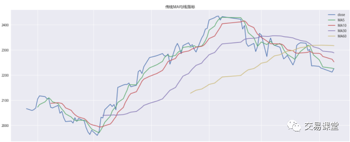
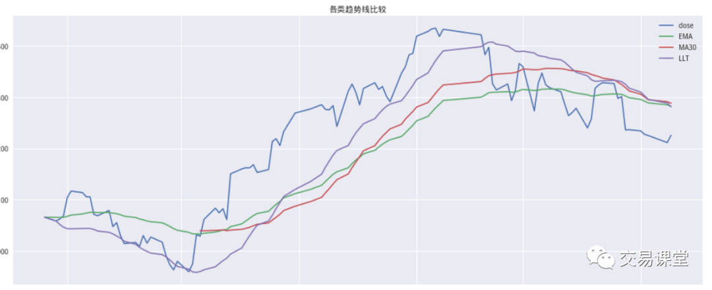

### 传统移动平均线（MA）的缺点

移动平均线（MA）是技术分析中常用的一类趋势跟踪指标，其可以在一定程度上刻画股票价格或指数的变动方向。MA 的计算天数越多，平滑性越好，但时滞带来的延迟影响也越严重。因此，在使用 MA 指标进行趋势跟踪时，容易出现“跟不紧”甚至“跟不上”的情况。平滑性和延迟性在 MA 指标中成为了不可避免的矛盾，这就促使我们去寻找化解这一矛盾的工具和方法。

### 低延迟趋势线（LLT）的构造
与 MA 类似的均线指标还有 EMA，其本质是在计算中对靠近计算日的价格赋予更大的权重。EMA 指标的计算方式在信号处理理论中恰好对应着一类一阶低通滤波器，其可以将信号的高频分量进行有效的过滤。通过分析，我们认为如果希望滤波效果更好，则需要选择合适阶数的滤波器。上述一阶滤波的效果相对较差，通带和阻带间的过渡带太长；阶数越高，滤波器传输函数在截止频率附近衰减得越快，但同时通带会变得不平，也就是靠近截止频率的信号会有些放大。因此折中来看，可以选择二阶滤波器，我们根据二阶滤波器设计了 LLT 低延迟趋势线，发现其在低频部分的输出信号较强，同时相比 MA 均线和 EMA 均线，延迟大幅下降。

### LLT 趋势线可以实现交易性趋势择时
我们将 LLT 趋势择时应用于沪深 300、上证指数、深证成指等市场指数的日数据，通过切线法进行方向判断，获得良好的风险收益情况。相比MA 趋势择时，我们发现 LLT 模型的择时周期更短，稳定性也更好。不过采用切线法对趋势线进行追踪有一个问题，就是在趋势拐点附近，切线斜率容易在零附近震荡，从而造成多次择时判断且正确率下降的情况，这相当于在择时模型中内嵌了一定的止损机制，因此我们将这类择时方法称为交易性择时。对于 LLT 指标，趋势一旦确立，持仓可以保持相对较长的盈利时间，而在拐点附近的震荡交易次数虽多，但持仓时间往往都很短。因此对于交易性择时来说，在判断正确率相对较低的情况下，判断正确的时间占比却往往较高，并且盈利也主要来自于这一部分的贡献。

### LLT 趋势择时可应用于股票、ETF、期货等金融产品的交易
基于 LLT 对趋势跟踪的有效性，我们认为 LLT 趋势择时可应用于股票、ETF、期货等金融产品的交易。在本篇报告中，我们实证计算了 LLT 在 ETF趋势交易中的应用，获得了良好的风险收益表现。

## 传统均线系统

跟随市场趋势是一种简单有效的投资方式。在市场处于上升趋势时，投资者可以买入并持有；当市场转为下降趋势时，投资者可以选择卖空或空仓。跟随趋势最简单的办法是采用移动平均（Moving Average）线,其算法为：$MA(n)=\frac{1}{n}\sum_{i=0}^{n-1}Price(T-i)$。

其中 price一般选择收盘价, $MA(n)$即为$T$日的$n$日均线指标。对于MA指标，$n$越大，趋势线的平滑性越好。MA指标可以很好地刻画指数或股票价格趋势，但其最大的问题在于存在延迟。如下图所示的指数日线及 MA 均线系统，蓝色、橙色、紫色、绿色分别代表 5 日、 10 日、30 日和 60 日均线。可以看出，随着均线分母n的增加，MA 指标的局部波动显著减小（即平滑性越来越好），但趋势跟随也出现了越来越高的延迟。

## 低延迟趋势线 LLT 的构造

$$
\frac{LLT(z)}{price(z)}=\frac{(a-a^2/4)+(a^2/2)z^{-1}-(a-3a^2/4)z^{-2}}{1-2(1-a)z^{-1}+(1-a)^2z^{-2}},
$$
对比传统 MA 均线指标、EMA 指标、修正 EMA 指标，以及低延迟趋势线 LLT 指标,可以看出，相对其他趋势线指标，LLT 具有更显著的拐点和更低的延迟。

